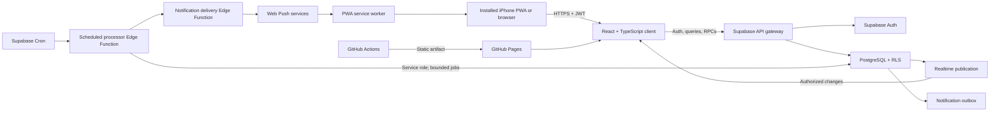
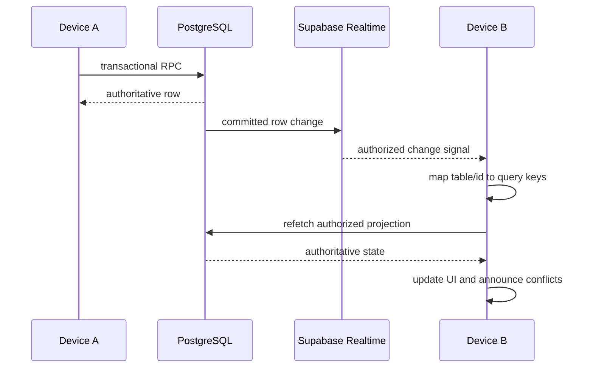
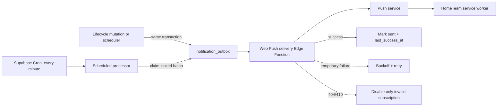
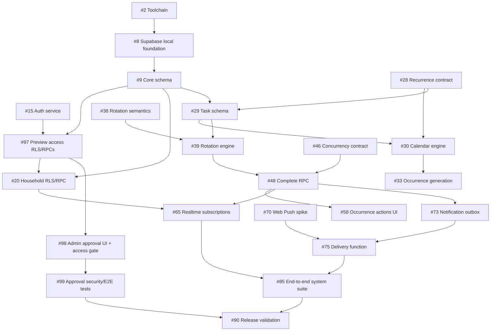

# HomeTeam Architecture

## 1. Architecture goals

HomeTeam is an online-only, mobile-first PWA backed by Supabase. PostgreSQL is the source of truth for authorization, task state, recurrence, rotation, audit history, and notification work. The frontend renders authoritative records and never becomes the arbiter of lifecycle transitions.

The architecture prioritizes:

1. one authoritative row per scheduled occurrence;
2. first-valid-update-wins concurrency;
3. database-enforced household and guest isolation;
4. append-only history;
5. deterministic household-timezone scheduling;
6. idempotent occurrence and notification generation;
7. explicit contracts that implementation agents can follow without redesign.

## 2. System architecture



Trust boundaries are the browser/service worker, Supabase public API under RLS, privileged scheduled/notification functions, external push services, and GitHub deployment. Details are in `SECURITY_MODEL.md`.

## 3. Frontend architecture

### Runtime and organization

Use React with strict TypeScript and Vite. Organize by domain:

```text
src/
  app/              providers, router, startup, error boundaries
  components/       shared accessible presentation components
  features/
    auth/
    households/
    categories/
    tasks/
    occurrences/
    recurrence/
    rotation/
    history/
    realtime/
    notifications/
    pwa/
  hooks/            cross-feature hooks only
  lib/              Supabase client, query client, dates, errors, env
  routes/           route-level composition and lazy boundaries
  services/         narrowly shared API/RPC adapters
  styles/           Tailwind entry and design tokens
  test/             test renderers, fixtures, and mock server helpers
```

Business rules belong in pure domain modules, database functions, or typed services—not presentation components.

### Routing

Use `createHashRouter` so routes survive GitHub Pages refreshes under both repository subpaths and custom domains. Public routes are `/login`, `/verify`, and `/invite/:token`. Authenticated-but-unapproved users are restricted to `/access-status`. Approved users enter the product session gate; `/today` is the default. Platform administrators additionally receive `/admin/access`, but administrator status alone does not unlock household routes. Bottom-navigation routes are `/today`, `/upcoming`, `/tasks`, `/history`, and `/more`. Household, members, categories, notifications, profile, and installation pages nest under `/more`.

An intended location is serialized before authentication and restored only after validation. Invitation tokens must never be placed in logs or analytics; after acceptance, replace the route so the token is no longer visible.

### Server state and contracts

TanStack Query owns server state. Query keys are factory-generated:

```ts
['profile', userId]
['platform-access', userId]
['platform-access-requests', adminFilters]
['memberships', userId]
['household', householdId]
['occurrences', householdScope, filters]
['occurrence', occurrenceId]
['series', householdId, filters]
['series-detail', seriesId]
['history', householdScope, filters]
['notification-preferences', userId]
```

Mutation services accept Zod-validated inputs and return generated database types or a typed domain projection. Sensitive mutations wait for the authoritative RPC response, then replace/invalidate cached data. Do not show a successful optimistic completion, skip, assignment, or reopen before the server accepts it.

### UI shell and accessibility

The shell is mobile-first with safe-area-aware bottom navigation and a centered tablet/desktop content column. Status always uses text/icon plus color. Dialogs trap focus and restore it. Realtime conflicts use an `aria-live` announcement. Respect reduced motion, 44px minimum touch targets, semantic landmarks, and WCAG AA contrast.

## 4. Authentication flow

1. Client requests a six-digit email OTP through Supabase Auth.
2. Client verifies the token with the supplied email.
3. A profile/access bootstrap trigger idempotently creates `profiles` and a `pending` `platform_access` row.
4. The client fetches its authoritative platform access state.
5. Pending, rejected, or suspended users are restricted to the access-status route and sign-out; protected queries and Realtime channels do not start.
6. Approved users restore the validated intended route and may proceed to household authorization.
7. Platform administrators may use the separate access-review route and RPCs; they receive no implicit household membership.
8. Session refresh is handled by Supabase; the app clears protected caches on sign-out, suspension, or approval revocation.
9. Invitation acceptance verifies both approved platform access and the authenticated email against a normalized invited email inside a transactional function.

Only publishable frontend credentials are loaded by Vite. The service-role key and VAPID private key exist only as Supabase secrets.

## 5. Platform access approval model

`platform_access` has one row per authenticated user with state `pending`, `approved`, `rejected`, or `suspended`, request/decision timestamps, and the deciding administrator where applicable. `platform_administrators` contains the small set of user UUIDs permitted to review access. `platform_access_events` is append-only and records every decision or restoration.

The initial administrator is inserted by UUID through a privileged migration parameter or documented one-time SQL operation after their Supabase Auth user exists. That operation atomically creates the administrator record, sets the same user to `approved`, and appends a bootstrap access event so there is no unapproved-administrator deadlock. No administrator email is hard-coded.

Stable authorization helpers:

```sql
private.is_approved_user(actor uuid)
private.is_platform_administrator(actor uuid)
```

Every household/product RLS predicate and security-definer RPC checks `private.is_approved_user(auth.uid())` before role- or target-specific authorization. Only the access-status projection remains readable to a non-approved authenticated user.

Administrator RPCs are:

```text
approve_platform_access(target_user_id, note)
reject_platform_access(target_user_id, note)
suspend_platform_access(target_user_id, note)
restore_platform_access(target_user_id, note)
```

Each function derives the administrator from `auth.uid()`, locks the target access row, validates the transition, updates state, and appends a decision event in one transaction. Approval is idempotent only when the requested final state already matches; conflicting transitions return structured errors.

## 6. Household, membership, and category model

`households` owns an IANA timezone and is soft-deletable. `household_memberships` has one active row per `(household_id, user_id)` and exactly two roles: `full_member` and `guest`. A partial unique index prevents duplicate active memberships. Membership removal sets `removed_at` and status, immediately failing RLS predicates.

Full members can read and manage household resources through policy-approved reads and controlled writes. Guests can read minimal household identity, their own membership, occurrences assigned to them, the minimum series/category projection required to render those occurrences, and related event records. Category deletion nulls task references or presents them as uncategorized; it never deletes tasks.

Invitations store a SHA-256 or stronger hash of a random high-entropy token, a normalized email, role, expiry, revocation, and acceptance metadata. The raw token exists only in the outbound invitation URL.

## 7. Task-series and occurrence model

`task_series` stores definition-level behavior. `task_schedule_slots` normalizes daily exact times, flexible windows, and all-day slots. A versioned `recurrence_config` JSONB stores rule shape that would be awkward to normalize; a CHECK function validates it. `task_rotation_members` stores the ordered active roster.

`task_occurrences` is the authoritative scheduled instance. `occurrence_key` is deterministic and unique per series:

- calendar schedule: `calendar:<local-date>:<slot-id>`;
- one-time: `once:<series-id>`;
- completion interval: `interval:<predecessor-occurrence-id>`.

A unique constraint on `(series_id, occurrence_key)` makes generation idempotent. UTC timestamps are authoritative; local recurrence rules and household timezone are retained so UTC instants can be regenerated deterministically.

Lifecycle state is stored as `open`, `completed`, `skipped`, `cancelled`, or `deleted`. Upcoming, due now, overdue, and snoozed are projections computed from state, due bounds, `snoozed_until`, and the household timezone. No database job changes a row merely because time passed.

## 8. Recurrence engine

The recurrence engine is a pure, versioned TypeScript/PostgreSQL-compatible rules layer with fixtures shared across tests. It accepts:

```ts
type GenerationInput = {
  seriesId: string;
  timezone: string;
  recurrence: RecurrenceConfigV1;
  slots: ScheduleSlot[];
  rangeStart: string;
  rangeEnd: string;
  existingOccurrenceKeys: string[];
};
```

It returns candidate local dates, resolved UTC due bounds, and deterministic occurrence keys. Calendar generation maintains a rolling 30-day horizon. DST policy:

- nonexistent local time: move forward to the first valid instant that day and record the resolution;
- repeated local time: choose the earlier offset;
- all-day: start at local midnight and become overdue at the next local midnight;
- flexible windows resolve each endpoint independently and may span midnight only when explicitly represented by an end-day offset.

Completion-interval series normally have one open occurrence. Their successor is inserted in the same transaction that completes or skips the predecessor. End dates/counts are checked before insertion.

The missed-policy processor is idempotent and locks candidate rows with `FOR UPDATE SKIP LOCKED`. It may close older open occurrences but never rewrites completed or skipped history.

## 9. Round-robin engine

The roster is ordered by `rotation_position`. Generation chooses the next eligible active member after the persisted rotation cursor/event outcome. Fixed and unassigned modes bypass the rotation engine.

When a full member completes another participant’s occurrence:

- advance after the actual completer when that user is active in the roster;
- advance after the original assignee when the completer is not in the roster;
- advance after the original assignee when `keep_original_rotation=true`.

The completion transaction records original assignee, actual completer, and the chosen rotation basis. It then recalculates only future, open, automatically assigned, unlocked occurrences. Completed, skipped, deleted, cancelled, or manually locked rows are immutable to that recalculation. Undo/reopen appends compensating events and deterministically recomputes the future cursor from surviving events.

## 10. Transactional mutations and concurrency

All lifecycle operations are `SECURITY DEFINER` functions with `SET search_path = pg_catalog, public`, explicit schema qualification, authenticated actor lookup, membership validation, row locking, lifecycle validation, and expected-version compare-and-swap.

Common RPC envelope:

```ts
type MutationResult<T> =
  | { ok: true; data: T }
  | {
      ok: false;
      error: {
        code:
          | 'access_denied'
          | 'stale_version'
          | 'already_completed'
          | 'already_skipped'
          | 'invalid_state'
          | 'guest_action_forbidden'
          | 'undo_window_expired'
          | 'invitation_expired'
          | 'invitation_email_mismatch';
        current?: unknown;
      };
    };
```

The SQL implementation may raise namespaced exceptions internally, but the generated client adapter must expose the typed result above.

### Task completion transaction

```mermaid
sequenceDiagram
    participant C as Client
    participant R as complete_occurrence RPC
    participant O as task_occurrences
    participant E as task_events
    participant N as notification_outbox
    participant G as Rotation/generation
    C->>R: occurrence_id, expected_version, keep_original_rotation
    R->>R: authenticate and authorize actor
    R->>O: SELECT ... FOR UPDATE
    R->>R: validate open state and version
    alt stale or already closed
        R-->>C: typed conflict + authoritative state
    else accepted
        R->>O: set completed fields; version = version + 1
        R->>E: append completion event
        R->>G: advance/recalculate rotation or create interval successor
        G->>E: append generated/recalculated events
        R->>N: insert idempotent outbox rows
        R-->>C: committed authoritative occurrence
    end
```

Claim, assign, reassign, complete, undo, reopen, skip, snooze, cancel, and delete all take `expected_version`. The first valid transaction commits; later contenders receive the current record and a typed conflict. Retries are safe only after refetching and explicit user intent.

## 11. Append-only history

`task_events` is insert-only to client roles. RLS exposes scoped reads, while triggers reject update/delete even when a future policy is misconfigured. Payloads are versioned and contain non-secret identifiers plus the before/after facts necessary for audit. Corrections append compensating events.

## 12. Realtime strategy

The client subscribes only after loading active memberships. Full members use household-scoped channels; guests use assignee-scoped occurrence/event feeds supported by RLS. Payloads are treated as invalidation signals, not trusted final state.



Channel managers are keyed by user and membership set. On sign-out or membership removal they unsubscribe first, cancel in-flight queries, and remove all protected cache entries. When the open occurrence changes remotely, show a nonintrusive banner and screen-reader announcement.

## 13. Notification outbox and Web Push

Mutation and scheduled transactions create `notification_outbox` rows with a unique semantic idempotency key. A once-per-minute scheduled processor claims due work using `FOR UPDATE SKIP LOCKED`, materializes recipients according to role and preferences, and invokes delivery in bounded batches.



Subscriptions are per device. Endpoints and keys are readable only by the owning user and privileged delivery code. Payload privacy is selected per user; guests are never considered for unrelated occurrences. Notification clicks contain an occurrence ID and open its hash route after authorization.

The Web Push implementation must be validated against the current Supabase Deno runtime in the dedicated compatibility issue before a library is selected.

## 14. Scheduled processing

One idempotent Edge Function, invoked about once per minute, orchestrates:

1. rolling calendar occurrence generation;
2. automatic missed-task policies;
3. expired-snooze notification eligibility;
4. due-soon and overdue outbox production;
5. bounded notification delivery/retry;
6. invalid subscription disabling.

Jobs use advisory locks or claim tables plus deterministic keys. Each phase has a time budget and cursor so the free-tier workload can resume safely. Completion-interval generation remains inside lifecycle RPCs, not the scheduler.

## 15. PWA and offline behavior

Use `vite-plugin-pwa`/Workbox to precache the app shell and safe static assets. Runtime caching may preserve recently fetched read screens, but authenticated API responses must be short-lived and cleared on identity/membership changes. Never register background sync for task mutations.

An online-state guard disables complete, skip, snooze, claim, assign, edit, cancel, and delete controls while offline and explains why. Push permission is requested only from a user-initiated action, with iPhone installation guidance first when needed. Service worker updates prompt the user before activation when an active form or mutation could be disrupted.

## 16. GitHub Pages and configuration

Vite base comes from validated `VITE_APP_BASE_PATH`; all manifest, icon, and service-worker URLs derive from it. Hash routing prevents server fallback requirements. GitHub Actions runs install, lint, typecheck, unit tests, and build before uploading a Pages artifact. Deployment uses GitHub’s Pages environment and no Supabase service-role secret.

Frontend environment:

```text
VITE_SUPABASE_URL
VITE_SUPABASE_PUBLISHABLE_KEY
VITE_APP_BASE_PATH
VITE_VAPID_PUBLIC_KEY
```

Supabase secrets:

```text
SUPABASE_SERVICE_ROLE_KEY
VAPID_PRIVATE_KEY
VAPID_SUBJECT
```

## 17. Testing layers

- pure unit tests: due-state, recurrence, rotation, filtering, and timezone fixtures;
- component tests: forms, dialogs, route guards, status sections, offline/conflict behavior;
- SQL tests: constraints, RPC state machines, compare-and-swap races, RLS, append-only events;
- integration tests: local Supabase with authenticated users and Realtime;
- Playwright: multi-session household, guest, lifecycle, rotation, edit/delete, and PWA flows;
- deployment checks: subpath assets, manifest, service-worker scope, and Pages artifact.

`TEST_STRATEGY.md` owns the traceability matrix and fixture standards.

## 18. Logging and observability

Frontend errors use structured codes and correlation IDs without emails, tokens, push endpoints, descriptions, or task titles by default. Edge Functions log job ID, phase, counts, duration, result class, and redacted error code. Database events are product audit records, not a substitute for operational logs. Outbox attempts preserve bounded diagnostic metadata with retention reviewed before release.

## 19. Migration strategy

Migrations are immutable, timestamped, and ordered:

1. extensions, enums, profiles, platform access, platform administrators, and access events;
2. households and memberships;
3. invitations and categories;
4. task series, schedule slots, rotations, occurrences;
5. events, notification preferences, subscriptions, outbox;
6. indexes and constraints;
7. platform approval and household RLS helper predicates and policies;
8. transactional functions and triggers;
9. Realtime publication and scheduled-processing support.

Each migration includes a forward test. Destructive fixes require a new migration. Generated TypeScript types are refreshed after schema changes. Production deployment applies database migrations before publishing frontend code that depends on them.

## 20. Security boundaries

The browser is untrusted. Authentication is not product authorization: an approved platform access row is required before household checks. Administrator status authorizes only access-review functions and never bypasses household RLS. Household IDs, roles, assignees, occurrence versions, and notification recipients supplied by a client are claims to validate, not authority. Direct writes are denied for lifecycle/event/outbox tables; controlled functions apply mutations. Privileged Edge Functions accept only cron/service authentication and never proxy arbitrary client input. See `SECURITY_MODEL.md`.

## 21. Version 2 extension points

Versioned recurrence and event payloads allow richer monthly schedules without rewriting v1 rows. Optional child tables can later support comments, attachments, medicine fields, task-specific notification preferences, or analytics. The occurrence state machine can add new closed states through migrations. Native apps can reuse the typed RPC boundary. None of these extensions are part of version 1.

## 22. Major issue dependencies


