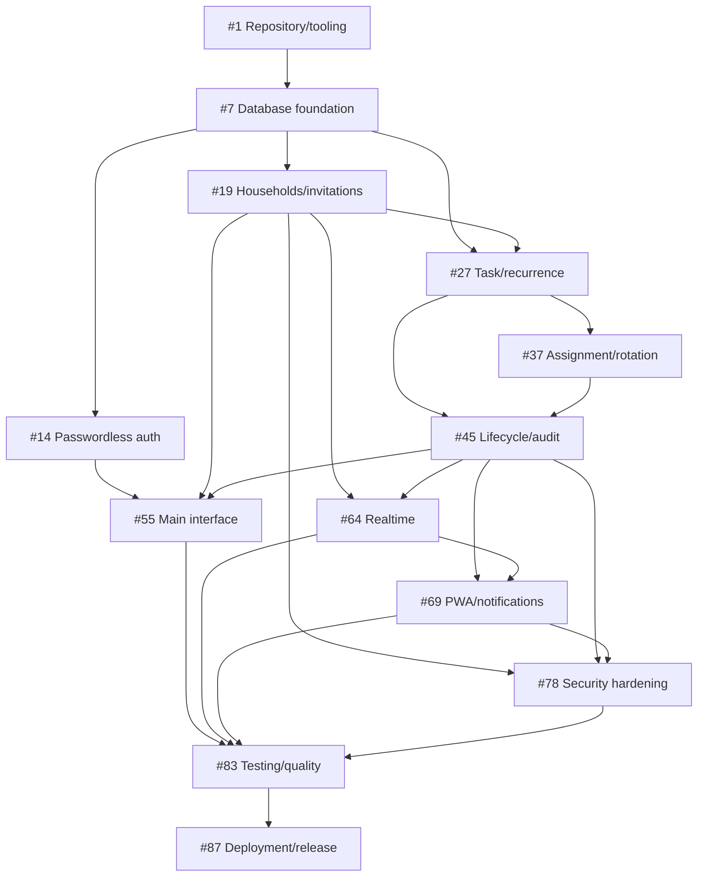

# HomeTeam Dependency Map

## 1. Milestone order

1. Repository and Tooling
2. Supabase and Database Foundation
3. Authentication and Households
4. Task and Recurrence Engine
5. Assignment and Rotation
6. Task Lifecycle and Audit History
7. Main Application Interface
8. Realtime Synchronization
9. PWA and Push Notifications
10. Security and Authorization Hardening
11. Testing and Quality
12. Deployment and Release Readiness

Tooling unlocks all code. Database identity/household structures and task schema can partially parallelize after Supabase setup. UI presentation can start from typed contracts before all backend RPCs are complete, but wiring and acceptance remain blocked. Security tests start with each migration; the hardening milestone is a release gate, not the first security work.

## 2. Epic dependencies

## 3. Critical path

The expected critical path is:

`#2 → #8 → #9 → #20 → #29 → #28/#30/#31 → #33 → #38/#39 → #46 → #48 → #65 → #70 → #73/#75/#76 → #79/#80 → #85/#86 → #90`

Why: tooling and local Supabase precede the authoritative schema; household authorization precedes task access; recurrence/rotation precede atomic completion; mutation events feed Realtime and notifications; guest/RPC hardening precedes system E2E and final release validation.

## 4. Parallel work

After #2–#4:

- #5 Pages workflow and #6 documentation/tooling can proceed in parallel.
- #10 task schema planning, #11 notification schema, and #12 seed/type generation can be prepared after #9.
- Auth UI (#16) can proceed against the contract from #15 while household database work (#20, #22) proceeds.
- Recurrence contract (#28) and task schema (#29) can proceed in parallel, converging at #30/#33.
- Rotation semantics (#38) may proceed alongside recurrence tests (#36).
- Today presentation (#57) can use typed fixtures while backend query work (#56) proceeds.
- Realtime architecture (#65) and Web Push compatibility (#70) are independent High Intelligence tasks after their prerequisites.
- PWA shell (#71), notification settings (#72), and outbox schema (#73) can proceed in parallel after #69 dependencies.
- Unit/component quality (#84) and database/E2E quality (#85) can run in parallel after feature completion.

## 5. Sequential work

- #9 core schema precedes RLS helpers, task schema, and generated types.
- #28 recurrence contract plus #29 task schema precede calendar generation.
- #38 semantics precede #39 engine; #39 precedes round-robin transaction integration.
- #46 concurrency contract precedes every lifecycle RPC.
- #48 completion precedes Undo/reopen and interval-successor integration acceptance.
- #73 outbox and #70 compatibility decision precede #75 delivery.
- #79 guest isolation and #80 definer-function audit precede release-grade database/E2E tests.
- #84–#86 must pass before #90 release validation.

## 6. Atomic dependency table

Each atomic issue states `Blocked by #…` or `Blocked by external condition …`. The GitHub Project `Dependency Status` field must be `Blocked` until all listed issue dependencies are closed. The first Ready implementation issue is #2. The Project must not mark future issues Ready merely because their milestone exists.

## 7. External dependencies and Christopher-owned setup

| Dependency | Needed by | Current effect |
|---|---|---|
| Supabase organization/project and project reference | Database integration, production deployment | Local work can proceed; production deploy blocked |
| Supabase CLI authentication/access token | Remote migrations/Functions | Local work can proceed |
| OTP email provider/template configuration | Real email E2E | CI can use local/mock flow |
| VAPID key pair and subject | Real Web Push | Compatibility and mocked tests can proceed |
| iPhone/iOS Safari device | Install/push manual validation | Automated PWA checks can proceed |
| GitHub Pages enablement/environment | Production static deployment | Workflow can be built/tested |
| Optional custom domain/DNS | Custom-domain validation | Repository-subpath deployment can proceed |
| Production alert/retention decisions | Operations hardening | Defaults may be documented; final approval required |

No privileged credentials should be placed in an issue body, repository file, Project field, or chat transcript.

## 8. Potential blockers and mitigation

- **Private-repository Pages entitlement/settings:** document and validate account capability; repository build remains useful if production Pages requires a plan change.
- **Supabase free-tier cron/Edge limits:** use bounded idempotent batches and measure in staging.
- **Deno Web Push incompatibility:** #70 resolves before implementation; use a minimal standards-compatible alternative if needed.
- **Realtime RLS behavior for guest projections:** prototype in #65 and prove with #68/#79 tests.
- **DST ambiguity:** freeze D-004 and test both transitions before generation integration.
- **Project view API limitations:** create all supported fields/items through API and document any view that must be configured manually in GitHub UI.

## 9. Graph validation

The planned graph is acyclic: all atomic dependencies point to a lower issue number or an explicitly documented external condition. Epics depend conceptually on earlier epics but are tracking containers, not implementation blockers. Atomic issues are sized for one focused branch/PR and have at least one test owner.
