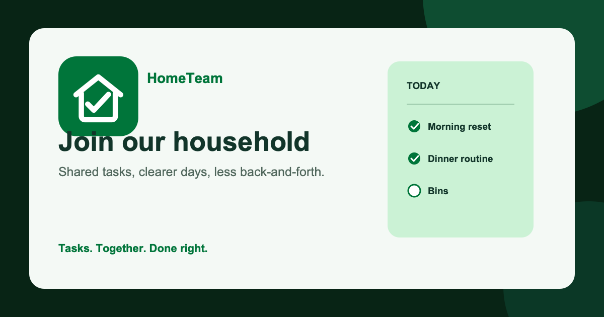

# HomeTeam

**Tasks. Together. Done right.**

HomeTeam is a shared household task app for keeping routines visible, ownership clear, and progress in sync. It works in a browser or as an installable phone PWA, with one shared source of truth for every scheduled task occurrence.

[Open HomeTeam](https://hometeam.christopherbrown.ai/) · [Product specification](PRODUCT_SPEC.md) · [Architecture](ARCHITECTURE.md)



## What you can do

- Create or join multiple households and switch between them.
- Sign in with a username and password; HomeTeam does not require a personal email address.
- Add one-time tasks, daily/weekly/monthly routines, or tasks that recur after completion.
- Schedule tasks for a specific time, a time range, or all day, using the household's timezone.
- Assign work to a household member, leave it open for someone to claim, or rotate it through an ordered roster.
- See the right work at the right time in Today and Upcoming, with clear Overdue, Due now, and Later today states.
- Complete, skip, snooze, undo, pause, resume, edit, or delete tasks while preserving the household history.
- Review who changed what and when in History, including assignment and lifecycle activity.
- Invite people with a revocable, expiring share link and control what guests can see.
- Keep household updates synchronized in real time across signed-in devices.
- Organize work with household categories and install HomeTeam on a phone home screen.

## How it works

1. Create a household or open a private invite link.
2. Add the routines your home actually needs.
3. Open Today to see what needs attention, then complete, skip, or snooze an occurrence.
4. Use Tasks to adjust the schedule, ownership, or rotation for future work.
5. Use Upcoming and History to plan ahead and understand what happened.

HomeTeam is currently in preview. New accounts require platform approval before household data is available. Once approved, a full member can create a household and invite others; guests only receive the household data and occurrences they are authorized to see.

## Scheduling at a glance

| Schedule | Use it for |
| --- | --- |
| One time | A single chore, errand, or reminder |
| Daily | Routines that happen every day |
| Weekly | One or more selected weekdays |
| Monthly | A day of the month, clamped to the last day when needed |
| After completion | Work that should recur after the previous occurrence is handled |

Every schedule can use timed or all-day slots, optional end times, an end date or occurrence limit, a missed-task policy, and the household's IANA timezone.

## Run it locally

HomeTeam uses Node.js 22+ and npm.

```sh
npm install
cp .env.example .env.local
npm run dev
```

Set these browser-safe values in `.env.local`:

```sh
VITE_SUPABASE_URL=https://your-project-ref.supabase.co
VITE_SUPABASE_PUBLISHABLE_KEY=your-publishable-key
VITE_APP_BASE_PATH=/
```

Never put a database password, service-role key, VAPID private key, or other privileged secret in a `VITE_` variable. Vite embeds those values in the browser bundle.

### Preview access setup

In Supabase, keep **Authentication → Providers → Email → Confirm email** disabled so password sign-up can create a usable session. The first production sign-in creates a pending access request. Bootstrap the first platform administrator once from the Supabase SQL editor, using that account's UUID from `auth.users`:

```sql
select private.bootstrap_platform_administrator('<authenticated-user-uuid>');
```

The administrator can then approve other preview requests at `#/access`. Administrator status is separate from household membership and never grants household data access.

### Local Supabase

For a fully local database, install Docker Desktop (or another Docker-compatible runtime) and start Supabase from the repository root:

```sh
npx --yes supabase@2.110.0 start
npx --yes supabase@2.110.0 status -o env
npx --yes supabase@2.110.0 db reset
```

Copy the local `API_URL` and browser-safe `ANON_KEY`/publishable key from `status` into `.env.local`. Supabase Studio is available at `http://127.0.0.1:54323`.

## Quality checks

```sh
npm run check       # lint, typecheck, unit tests, and production build
npm run test:e2e    # Playwright browser smoke tests
npm run test:db     # Supabase migration and database/RLS tests
```

The GitHub Actions checks run on pushes and pull requests. Merges to `main` build and deploy the PWA to GitHub Pages; the custom domain is configured at [hometeam.christopherbrown.ai](https://hometeam.christopherbrown.ai/).

## Security model

HomeTeam treats the browser as untrusted:

- PostgreSQL Row Level Security and controlled RPCs enforce household authorization.
- Full members and guests have deliberately different read and mutation permissions.
- Platform approval is separate from household membership; administrator status never grants household data access.
- Privileged keys stay out of the frontend bundle and committed files.
- Task lifecycle changes are authoritative, versioned transactions, and history is append-only.

HomeTeam notifications are coordination aids. They should not be treated as the sole medically reliable reminder system.

## Project reference

The product is documented alongside the code for anyone extending or operating it:

- [Product specification](PRODUCT_SPEC.md) — product behavior and version 1 scope
- [Architecture](ARCHITECTURE.md) — system boundaries, contracts, and data flow
- [Security model](SECURITY_MODEL.md) — authorization, RLS, secrets, and mitigations
- [Test strategy](TEST_STRATEGY.md) — test layers and requirement coverage
- [Implementation plan](IMPLEMENTATION_PLAN.md) — milestone and issue traceability
- [Decisions](DECISIONS.md) — settled defaults and trade-offs
- [Dependency map](DEPENDENCY_MAP.md) — implementation order and external blockers
- [Supabase migration guide](supabase/migrations/README.md) — database change workflow

## Contributing

Before changing product behavior, read the product specification, architecture, security model, and the linked issue. Keep changes focused, include the relevant tests and documentation, and run the quality checks above before opening a pull request. See [CONTRIBUTING.md](CONTRIBUTING.md) for the repository workflow.
