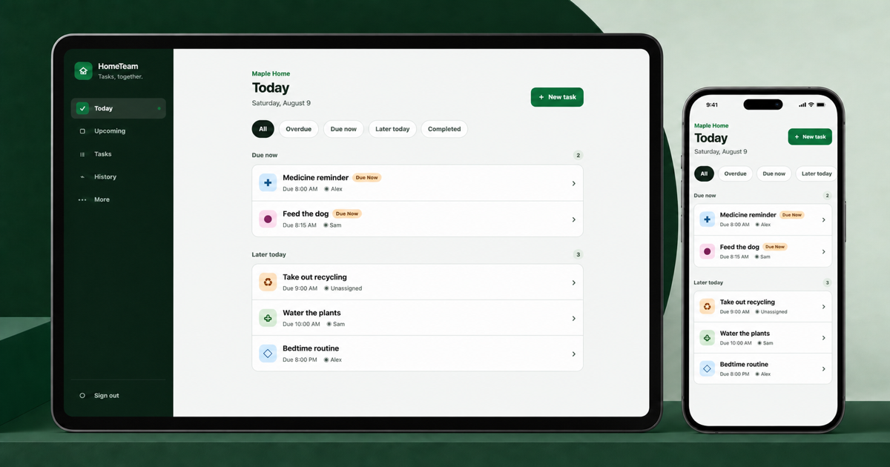

# HomeTeam

**Tasks. Together. Done right.**

[](https://github.com/christopherrbrown3/hometeam/actions/workflows/ci.yml)
[](https://github.com/christopherrbrown3/hometeam/actions/workflows/deploy-pages.yml)

HomeTeam is a shared household task app for keeping routines visible, ownership clear, and progress in sync. It works in a browser or as an installable phone PWA, with one shared source of truth for every scheduled task.

[Open HomeTeam](https://hometeam.christopherbrown.ai/) · [Read the product specification](PRODUCT_SPEC.md) · [Explore the architecture](ARCHITECTURE.md)



## 🏠 Why HomeTeam

With kids, pets, and a house to run, too many of our messages sounded like this:

> “Has Wilson had his pills?”
>
> “Whose turn is bedtime?”
>
> “Did somebody already feed the dog?”

The hard part was not remembering that something needed to happen. It was knowing who was responsible and whether it had already been done. HomeTeam turns that back-and-forth into a shared, auditable answer.

## ✨ What you can do

- Create or join multiple households and switch between them.
- Add one-time tasks, daily/weekly/monthly routines, or tasks that recur after completion.
- Schedule tasks for an exact time, a flexible window, or all day in the household's timezone.
- Assign work to one person, leave it open to claim, or rotate it through an ordered roster.
- See Overdue, Due now, and Later today work at a glance.
- Complete, skip, snooze, undo, pause, resume, edit, or delete tasks while preserving history.
- See who was assigned, who actually completed the task, and what changed.
- Invite full members or limited-access guests with a revocable, expiring link.
- Keep authorized updates synchronized across signed-in devices with Supabase Realtime.
- Install HomeTeam on a phone home screen as a PWA.

## 🧭 How it works

1. Create a household or open a private invite link.
2. Add the routines your home actually needs.
3. Open Today to see what needs attention, then complete, skip, or snooze an occurrence.
4. Use Tasks to adjust schedules, ownership, and rotation for future work.
5. Use Upcoming and History to plan ahead and understand what happened.

Every scheduled occurrence has one authoritative database row. Lifecycle changes use version-checked PostgreSQL functions, so two people cannot unknowingly complete the same occurrence at the same time.

### Scheduling at a glance

| Schedule | Good for |
| --- | --- |
| One time | A single chore, errand, or reminder |
| Daily | Routines that happen every day |
| Weekly | One or more selected weekdays |
| Monthly | A day of the month, clamped when the month is shorter |
| After completion | Work that should recur after the previous occurrence is handled |

## 🧱 Built with

- **Frontend:** React, TypeScript, Vite, React Router, TanStack Query, React Hook Form, Zod, and Tailwind CSS
- **Backend:** Supabase Auth, PostgreSQL, Row Level Security, Realtime, migrations, and transactional RPCs
- **PWA:** `vite-plugin-pwa` and Workbox with an online-only mutation model
- **Delivery:** GitHub Issues and pull requests, GitHub Actions, and GitHub Pages
- **Tests:** Vitest, React Testing Library, Playwright, pgTAP, and local Supabase

```text
Browser / installed PWA
        │
        ├── Supabase Auth
        ├── PostgreSQL + RLS + transactional RPCs
        └── Authorized Realtime changes

GitHub pull request ── CI ── merge to main ── GitHub Pages
```

The browser is never the authority for task state or household access. PostgreSQL enforces authorization, concurrency, history, recurrence, and assignment rules; the React client renders the authorized result.

### Repository map

```text
src/                    React application and domain features
supabase/migrations/    Ordered schema, RLS, and RPC changes
supabase/tests/         Database, authorization, and concurrency tests
supabase/functions/     Scheduled-processing code
e2e/                    Playwright browser checks
.github/workflows/      CI and GitHub Pages deployment
```

## 🚧 Preview status

HomeTeam is a working, access-controlled preview deployed on a public URL:

- New accounts require administrator approval before any household data is available.
- Task mutations are online-only; the PWA does not queue changes for later replay.
- The notification schema and preferences foundation exist, but the current preview does not yet deliver Web Push notifications.
- HomeTeam is a coordination tool, not the sole medically reliable reminder system.

## 🚀 Run it locally

HomeTeam requires Node.js 22+ and npm.

```sh
npm install
cp .env.example .env.local
npm run dev
```

Set the browser-safe values in `.env.local`:

```env
VITE_SUPABASE_URL=https://your-project-ref.supabase.co
VITE_SUPABASE_PUBLISHABLE_KEY=your-publishable-key
VITE_APP_BASE_PATH=/
```

Never put a database password, service-role key, VAPID private key, or other privileged secret in a `VITE_` variable. Vite embeds those values in the browser bundle.

### Local Supabase

Install Docker Desktop (or another Docker-compatible runtime), then run:

```sh
npx --yes supabase@2.110.0 start
npx --yes supabase@2.110.0 status -o env
npx --yes supabase@2.110.0 db reset
```

Map the local `API_URL` and browser-safe `ANON_KEY`/publishable key from `status` into `.env.local`. Supabase Studio is available at `http://127.0.0.1:54323`.

### Preview access setup

In Supabase, keep **Authentication → Providers → Email → Confirm email** disabled. HomeTeam maps a normalized username to a non-routable internal Auth identifier, so it does not collect a personal email address.

The first production sign-in creates a pending access request. Bootstrap the first platform administrator once from the Supabase SQL editor, using that account's UUID from `auth.users`:

```sql
select private.bootstrap_platform_administrator('<authenticated-user-uuid>');
```

The administrator can then approve other preview requests at `#/admin/access`. Administrator status is separate from household membership and never grants household data access.

## ✅ Quality checks

```sh
npm run check       # lint, strict typecheck, unit/component tests, production build
npm run test:e2e    # Playwright browser smoke tests
npm run test:db     # Supabase migration, database, concurrency, and RLS tests
```

GitHub Actions runs these checks on pull requests and pushes to `main`. A separate workflow builds and deploys `main` to GitHub Pages at [hometeam.christopherbrown.ai](https://hometeam.christopherbrown.ai/).

## 🔐 Security model

HomeTeam treats the browser as untrusted:

- PostgreSQL Row Level Security and controlled RPCs enforce household authorization.
- Full members and guests have deliberately different read and mutation permissions.
- Platform approval is separate from household membership; administrators cannot browse household data by virtue of that role.
- Privileged keys stay out of the frontend bundle and committed files.
- Task lifecycle changes are authoritative, versioned transactions, and history is append-only.

See [SECURITY_MODEL.md](SECURITY_MODEL.md) for the trust boundaries, permission matrix, and required security tests.

## 📚 Project documentation

- [Product specification](PRODUCT_SPEC.md) — product behavior, constraints, and version 1 scope
- [Architecture](ARCHITECTURE.md) — system boundaries, contracts, and data flow
- [Security model](SECURITY_MODEL.md) — authorization, RLS, secrets, and mitigations
- [Test strategy](TEST_STRATEGY.md) — test layers and requirement coverage
- [Implementation plan](IMPLEMENTATION_PLAN.md) — original milestone and issue decomposition
- [Architecture decisions](DECISIONS.md) — settled defaults and trade-offs
- [Dependency map](DEPENDENCY_MAP.md) — original implementation order and external blockers
- [Migration guide](supabase/migrations/README.md) — local database and migration workflow
- [Contributing guide](CONTRIBUTING.md) — setup, checks, and working agreement

## 🤝 Contributing

Before changing product behavior, read the product specification, architecture, security model, and linked issue. Keep changes focused, include relevant tests and documentation, and run the applicable quality checks before opening a pull request.
